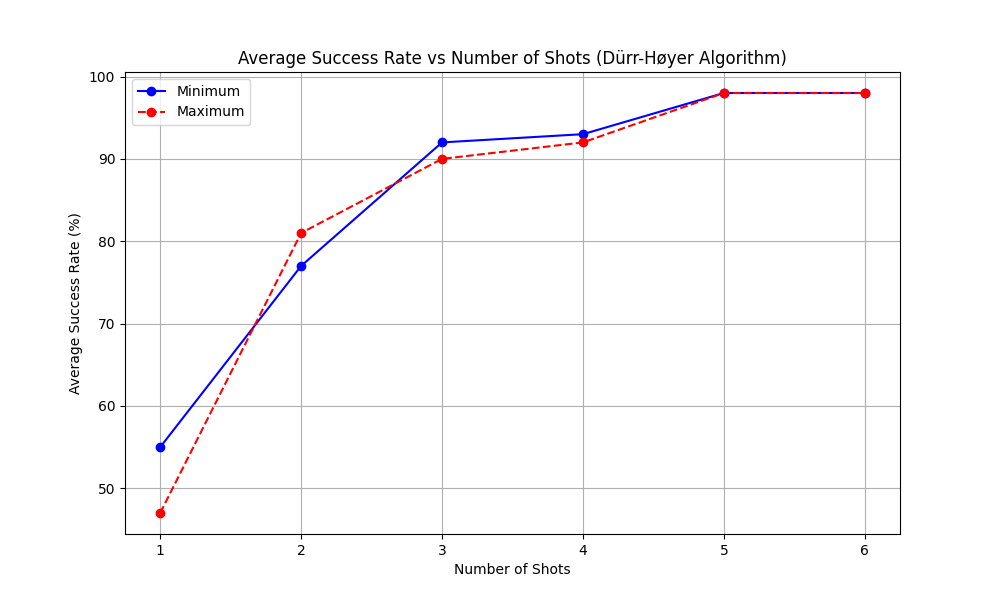
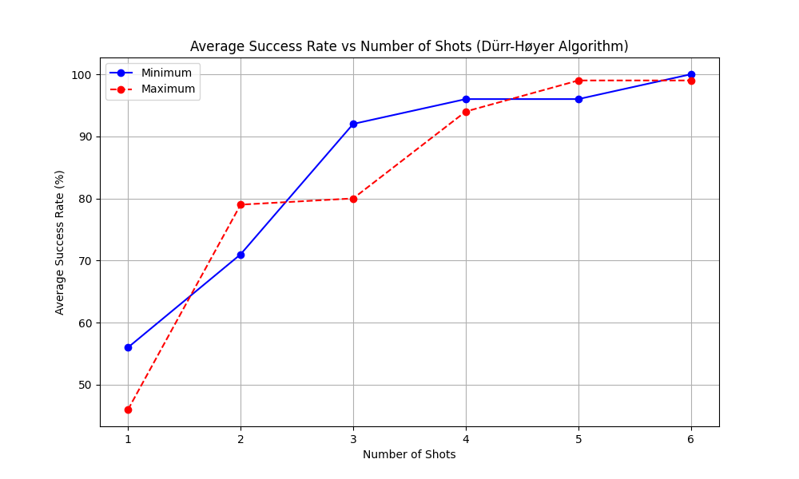

# DurrHoyerLibrary

- Rigetti Ankaa-9Q-3
  - Randomly Generated List of 6 elements, with max value of 5
  - Success Rate vs Number of shots of Durr Hoyer Algorithm
  - 100 Trials for each number of Shot(s)

- Rigetti Simulator QVM Results
  - Randomly Generated List of 6 elements, with max value of 5
  - Success Rate vs Number of shots of Durr Hoyer Algorithm
  - 100 Trials for each number of Shot(s)

- Ionq Aria Quantum Computer Results
  - No max results because above 7 is more than 4 qubits and the algorithm at this stage in testing was unable to dynamically allocate qubits to max number in list.
  
| **Run**           | **Randomly Generated List (N=10)**                      | **Actual Min** | **Min Search Result** | **Min Success** |
|-------------------|--------------------------------------|-----------------|-----------------------|------------------------------------|
| **1**  | [0, 7, 8, 4, 1, 2, 3, 5, 6, 9]      | 0               | 0                     | Success          
| **2**  | [10, 9, 7, 1, 0, 8, 2, 3, 6, 5]     | 0               | 0                     | Success          
| **3**  | [2, 8, 0, 3, 4, 9, 5, 10, 7, 1]     | 0               | 0                     | Success          
| **4**  | [0, 7, 8, 4, 1, 2, 3, 5, 6, 9]      | 0               | 0                     | Success         
| **5**        | [0, 8, 4, 3, 9, 1, 5, 6, 2, 7]      | 0               | 0                     | Success          
| **6**        | [2, 8, 0, 3, 4, 9, 5, 10, 7, 1]     | 0               | 2                     | Fail             
- Microsoft Quantum Simulator Results

| List     | Probability (Min) | List     | Probability (Max) |
|-----------------------|------------------:|---------------------|------------------:|
| [5, 3, 1, 2, 4]       |           51.9%   | [7, 5, 6, 1, 2]     |          99.8%    |
| [6, 5, 4, 3, 1]       |           52.6%   | [1, 5, 4, 3, 6]     |          52.2%    |
| [7, 5, 6, 1, 2]       |           51.9%   | [2, 3, 1, 5, 4]     |          51.3%    |
| [0, 3, 1, 2, 4]       |           99.8%   |                     |                   |
| [6, 0, 4, 3, 1]       |           51.0%   |                     |                   |
| [7, 5, 6, 0, 2]       |           50.4%   |                     |                   |

## Action Items

- [x] Unit Test for finding Min
- [x] Unit Test for finding Max
- [x] DurrHoyerAlgorithm Results on Quantum Computer
- [ ] Oracle and Unit Test for finding Median
- [ ] Oracle and Unit Test for finding Range
- [ ] Implement [QMSA](https://arxiv.org/pdf/1908.07943)

## Start venv

`source durrhoyer/bin/activate`

